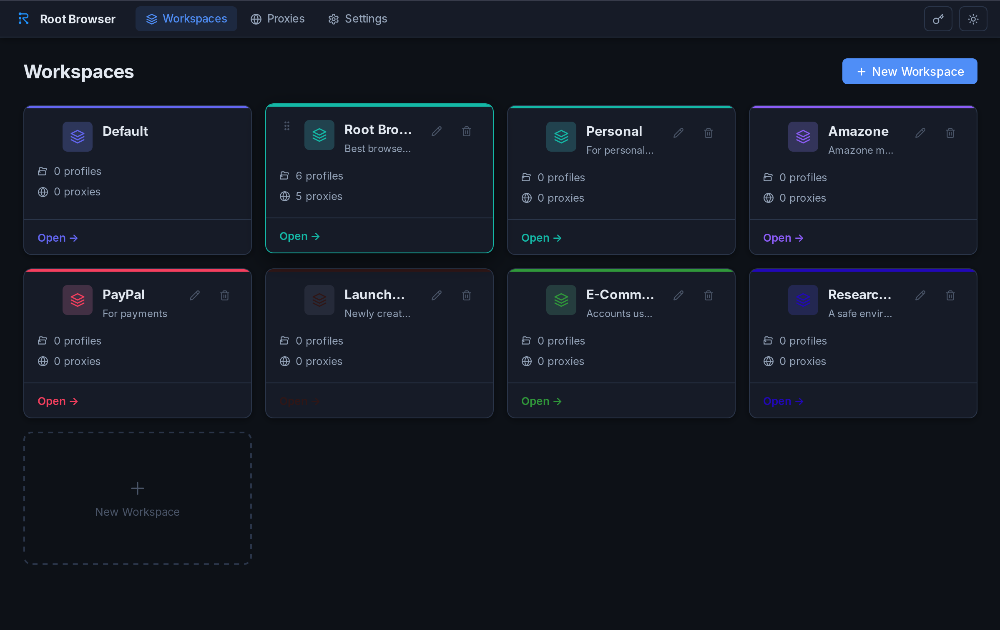
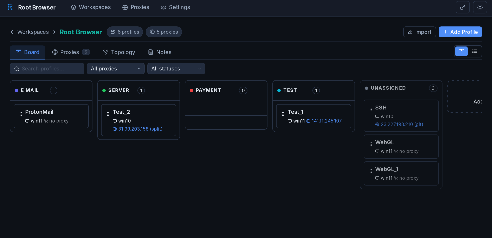
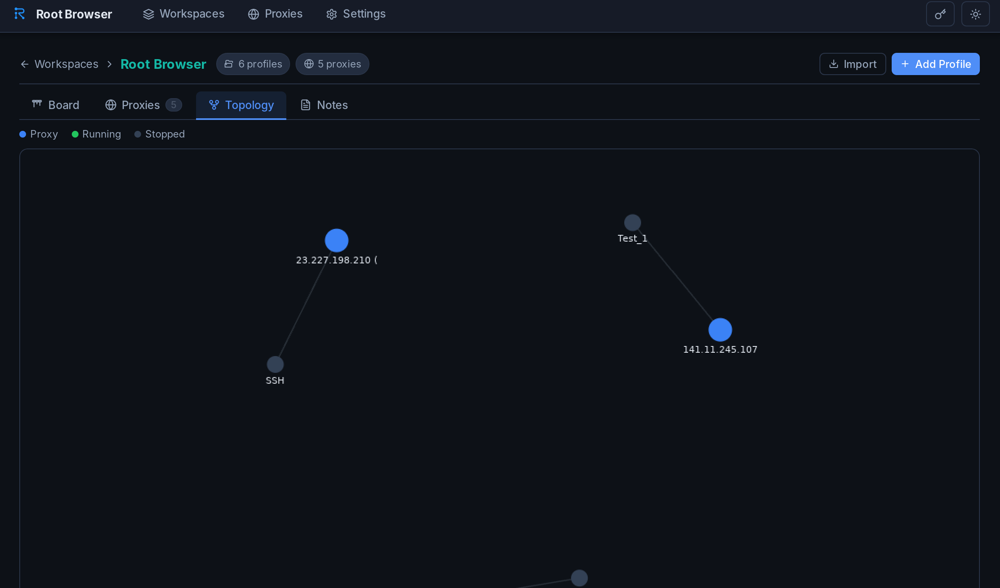
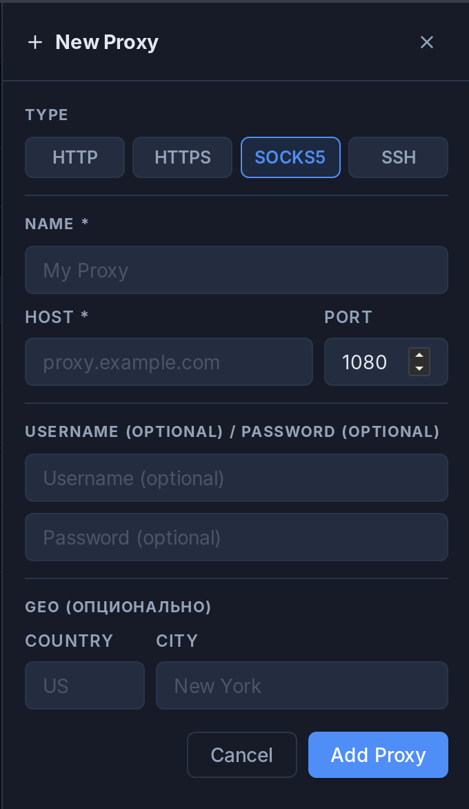
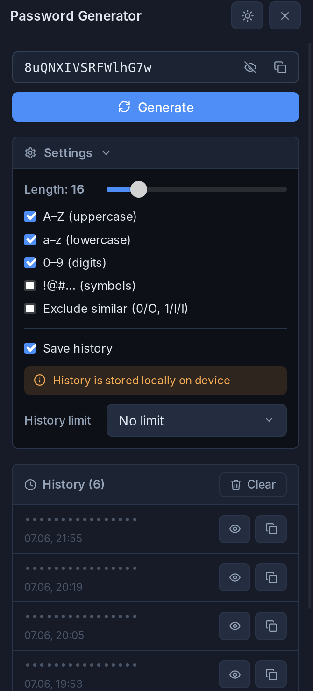

# RootBrowser

**Desktop antidetect Firefox profile manager powered by [Camoufox](https://github.com/daijro/camoufox)**

[](LICENSE)
[](https://tauri.app)
[](https://svelte.dev)
[](https://www.rust-lang.org)

---

## What is RootBrowser?

RootBrowser lets you create and manage isolated Firefox browser profiles with full fingerprint control. Each profile runs as a separate Camoufox instance — a patched Firefox that spoofs browser fingerprints at the engine level.

Organize profiles into **workspaces**, attach **proxies**, and track status on a **Kanban board**. Everything is stored locally — no cloud, no tracking.

---

## Screenshots



*Workspaces — organize your profiles by purpose*



*Kanban board — track profile status across custom columns*



*Topology view — visualize proxy connections*

<table>
  <tr>
    <td align="center"><br/><em>Add proxy — HTTP, HTTPS, SOCKS5, SSH</em></td>
    <td align="center"><br/><em>Built-in password generator with history</em></td>
  </tr>
</table>

---

## Features

### Profiles
- Create, clone, delete, and launch profiles
- Per-profile fingerprint configuration:
  - User-Agent, platform, OS (Windows 10/11, macOS, Linux)
  - Timezone, language, geolocation
  - WebGL vendor/renderer
  - Canvas & Audio noise seeds
  - WebRTC mode (disable / replace / real)
- Automatic `user.js` generation for Firefox prefs
- Visual window color tagging per workspace/tag

### Workspaces
- Group profiles into workspaces with color and icon
- Kanban board: `new → warmup → active → dead` + custom columns
- Table and topology graph views
- Bulk launch all profiles in a workspace

### Proxies
- HTTP / HTTPS / SOCKS5 support
- Per-profile and per-workspace proxy assignment
- Proxy checker via ip-api.com (IP, country, city)

### Import / Export
- Export profiles to JSON or ZIP (with proxy, passwords, Firefox profile files)
- Import from JSON / ZIP
- Cookie import/export

### Camoufox
- Download Camoufox directly from GitHub Releases inside the app
- Download progress tracking with cancel support
- Automatic setup of Firefox profile directories

---

## Tech Stack

| Layer     | Technology                              |
|-----------|-----------------------------------------|
| Shell     | **Tauri 2** (Rust)                      |
| Frontend  | **SvelteKit 2** + **Svelte 5** (runes) + **TypeScript** |
| Build     | **Vite 6**, `@sveltejs/adapter-static`  |
| Package   | **pnpm**                                |
| Database  | **SQLite** (sqlx + rusqlite)            |
| Browser   | **Camoufox** (antidetect Firefox fork)  |
| HTTP      | reqwest (proxy check, Camoufox download)|
| i18n      | English / Russian (built-in)            |

---

## Requirements

- [Node.js](https://nodejs.org) 20+
- [pnpm](https://pnpm.io)
- [Rust](https://rustup.rs) (stable toolchain)
- [Tauri prerequisites](https://tauri.app/start/prerequisites/) for your OS

---

## Getting Started

```bash
# Clone the repository
git clone https://github.com/vasaroot/RootBrowser.git
cd RootBrowser

# Install frontend dependencies
pnpm install

# Run in development mode
pnpm tauri dev
```

### Build for production

```bash
pnpm tauri build
```

The installer/binary will be in `src-tauri/target/release/bundle/`.

### Download Camoufox

After launching the app, go to **Settings** and click **Download Camoufox**. The app will fetch the latest release from GitHub and set it up automatically.

---

## Project Structure

```
RootBrowser/
├── src/                        # SvelteKit frontend
│   ├── lib/
│   │   └── components/         # UI components
│   └── routes/
│       ├── profiles/           # Profile management
│       ├── proxies/            # Proxy management
│       ├── settings/           # App settings
│       └── workspace/[id]/     # Workspace + Kanban
└── src-tauri/                  # Rust/Tauri backend
    └── src/
        ├── browser/            # Camoufox launch, user.js generation
        ├── commands/           # Tauri commands (profiles, proxies, workspaces)
        ├── proxy/              # Proxy checker
        ├── db.rs               # SQLite migrations
        └── fingerprint.rs      # Fingerprint presets
```

---

## License

Licensed under the [Apache License 2.0](LICENSE).

---

Made with ❤️ from Russia
